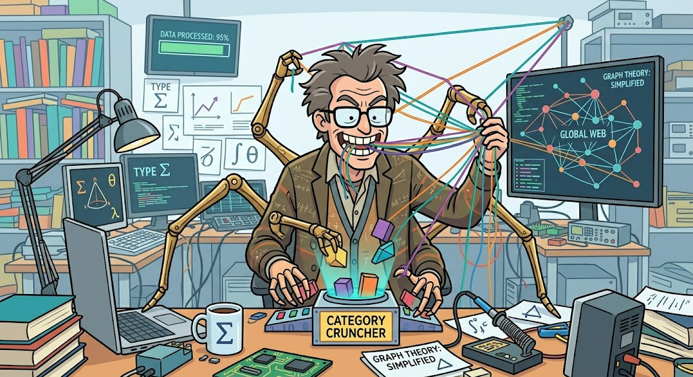

Code skills to control code quality during generation and review.

Skills strongly on control, human authority, explicitness,
dictatoriship of human on AI.

Leaning towards strong types, invariants, assertions, proofs, categories;
information theory, statistics, """physics"" and graphs metaphors to codebase,

